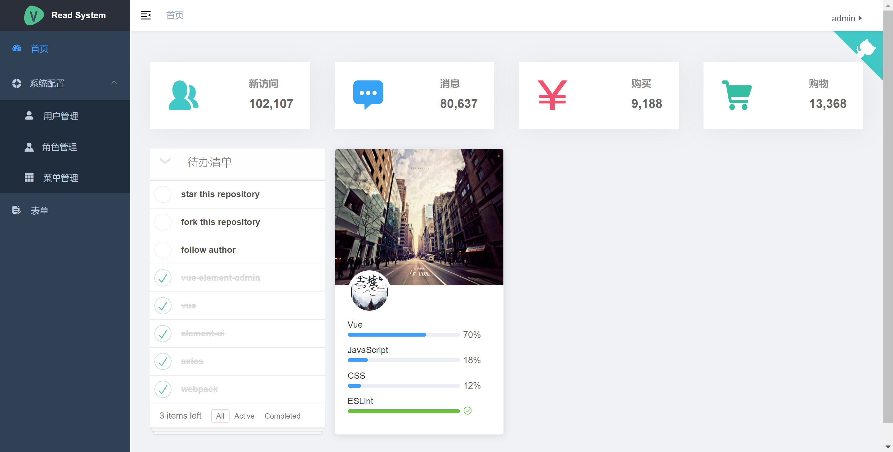

# ws-book-front

> - 这是一个根据vue-admin-template项目改造的简单后台管理系统。  
> - 它只包含了 Element UI、axios、router、permission、lint，这些搭建后台必要的东西。

## 目前实现的功能
>- 目前它仅拥有: 用户、角色、菜单、角色权限、登录、登出这几个基本的功能

## 后面的计划
>- 计划增加：quartz管理功能

## 配套使用的后端系统
* [后端](https://github.com/shuaiwu1108/ws-book)
* [移动端](https://github.com/shuaiwu1108/ws-book-front-app)


## 编译开发

```bash
# 进入项目目录
cd vue-admin-template

# 安装依赖
npm install

# 可以通过如下操作解决 npm 下载速度慢的问题，建议不要直接使用cnpm（可能会有BUG）
npm install --registry=https://registry.npm.taobao.org

# 启动服务
npm run dev
```

## 发布

```bash
# 构建测试环境
npm run build:stage

# 构建生产环境
npm run build:prod
```

## 其它

```bash
# 预览发布环境效果
npm run preview

# 预览发布环境效果 + 静态资源分析
npm run preview -- --report

# 代码格式检查
npm run lint

# 代码格式检查并自动修复
npm run lint -- --fix
```

## 页面

